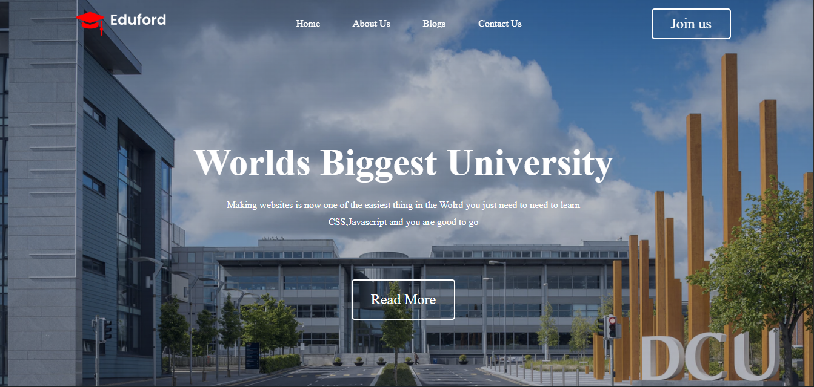
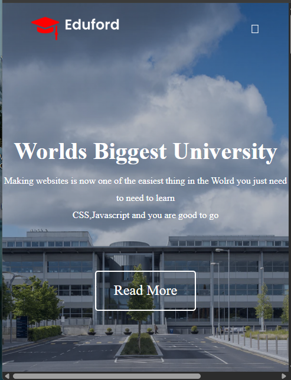

# 🎓 University Fully Responsive Webpage

A modern, fully responsive university website built with **HTML5, CSS3, and JavaScript**.  
This project showcases clean UI design, responsive layouts, and accessibility best practices — perfect for mobile, tablet, and desktop users.  

---

## 🚀 Features
- 📱 Fully responsive design for all screen sizes  
- 🎨 Modern navigation bar & hero section  
- 📚 Courses, testimonials, and contact sections  
- ⚡ Lightweight and fast-loading  
- ♿ Semantic HTML for accessibility  

---

## 📂 Project Structure
University-fully-responsive-webpage/
├── index.html # Main HTML file
├── style.css # Stylesheet
├── script.js # JavaScript for interactivity
├── /images # Project images & assets
└── README.md # Documentation

yaml
Copy code

---

## 📸 Preview
| Screenshots |  

| Desktop | Mobile |
|---------|--------|
|  |  |

👉 Create a `docs/` folder in your repo and add screenshots (`desktop.png`, `mobile.png`) for automatic preview.  

---

## 🛠️ Technologies
- **HTML5** — semantic  
- **CSS3** — flexbox, grid, animations, and responsive design  
- **JavaScript (vanilla)** — basic interactivity and DOM handling  

---

## 📦 Installation & Usage
1. **Clone the repository**
   ```bash
   git clone https://github.com/hawkins-254/University-fully-responsive-webpage.git

## author
 Hawkins Chris Muchui.